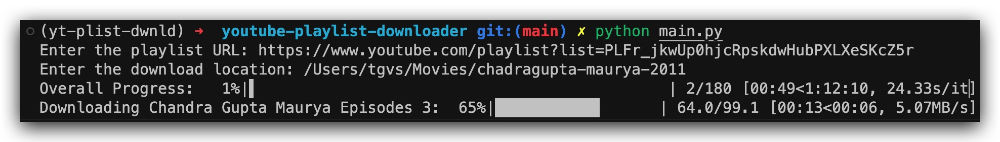

# Youtube playlist downloader

This scripts downloads playlist from youtube at a desired location in the same order as it is uploaded by the playlist owner/admin.

## Installation

Create directory in which you want to setup this project.

```bash
mkdir -p <directory-path>/youtube-playlist-downloader
cd <directory-path>/youtube-playlist-downloader
```

Clone the repo to your local machine.

```bash
git clone https://github.com/viren-sureja/yt-playlist-downloader.git .
```

Use the package manager [pip](https://pip.pypa.io/en/stable/) to install required libraries.

```bash
# [Optional] Setup virtual environment before installing the libraries.
pip install -r requirements.txt
```

## Usage

Run the script

```bash
python main.py
```

## Output

After running the script you will see something like this in the terminal
there will be two progress bar, one with overall progress and other about the progress of current video being downloaded with the internet speed.


Check whether videos are downloaded or not in the desired folder.

## Contributing

Pull requests are welcome, will be more than happy to merge the code. For major changes, please open an issue first
to discuss what you would like to change.

## License

[MIT](https://choosealicense.com/licenses/mit/)
